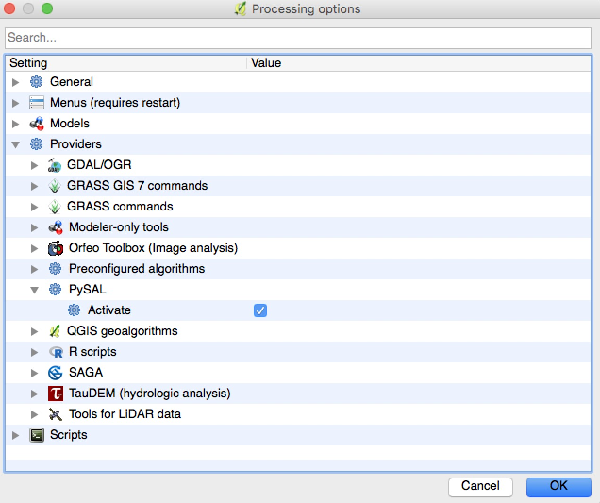
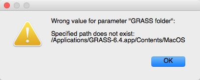
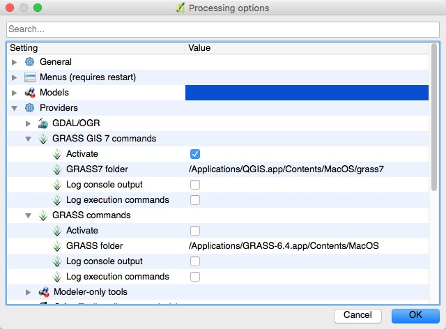
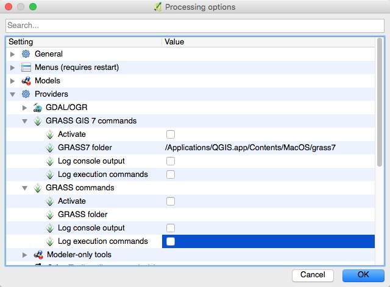
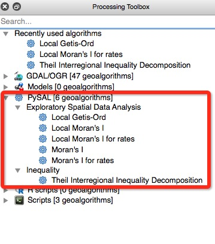

# processing_pysal

This project is related to https://github.com/anitagraser/QGIS-Processing-tools/wiki/PySAL-Integration

You may follow the following procedures to install the plugin:

* Install [pysal](https://github.com/pysal/pysal) on your computer 
(use easy_install, conda install, pip install...).

* Start QGIS and go to "QGIS"-"Preferences"-"System" and then scroll 
down to "Environment". Set the PYTHONPATH environment variable to point 
to where you pysal lives so that QGIS will be able to import pysal. 

* Clone the repo to the QGIS "plugins" directory on your computer. If 
you are using a Mac, it should be 
"/Applications/QGIS.app/Contents/Resources/python/plugins/".

* Restart QGIS, and go to "Plugins"-"Manage and Install Plugins...". 
You should see "PySAL for Processing" listed:

* Go to "Processing"-"Options", activate PySAL: 

If you are using a Mac, there is a high chance that the following error occurs:

This is because that GRASS is not installed in the machine you are using 
and QGIS activates GRASS plugin by default:

Since we are not using GRASS plugin at this moment, we mihgt as well 
deactivate it and specify "GRASS commands"-"GRASS7 folder" blank 
instead of trying to install the software.

* You should be able to see the plugin in the Processing Toolbox now. 

