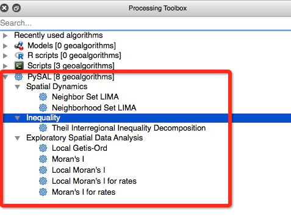
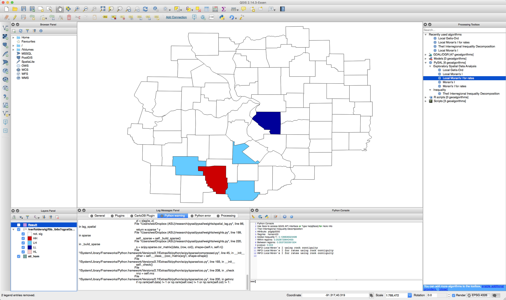
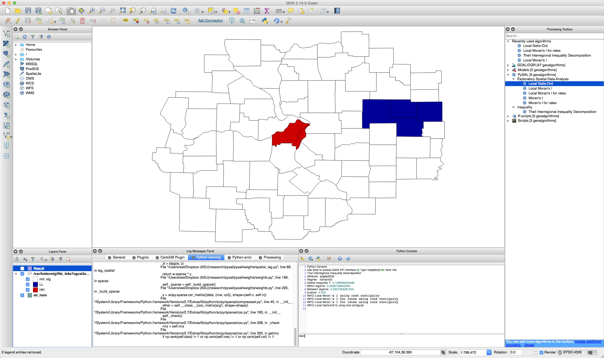
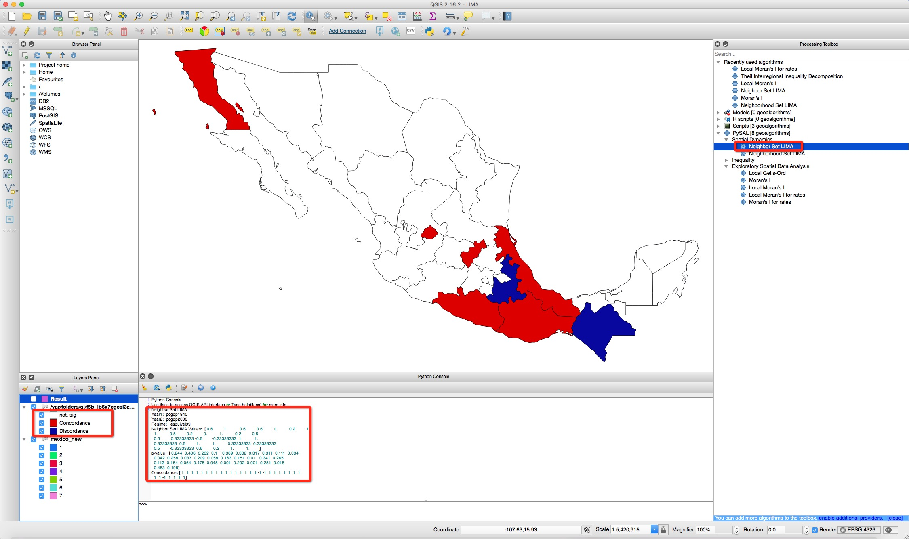
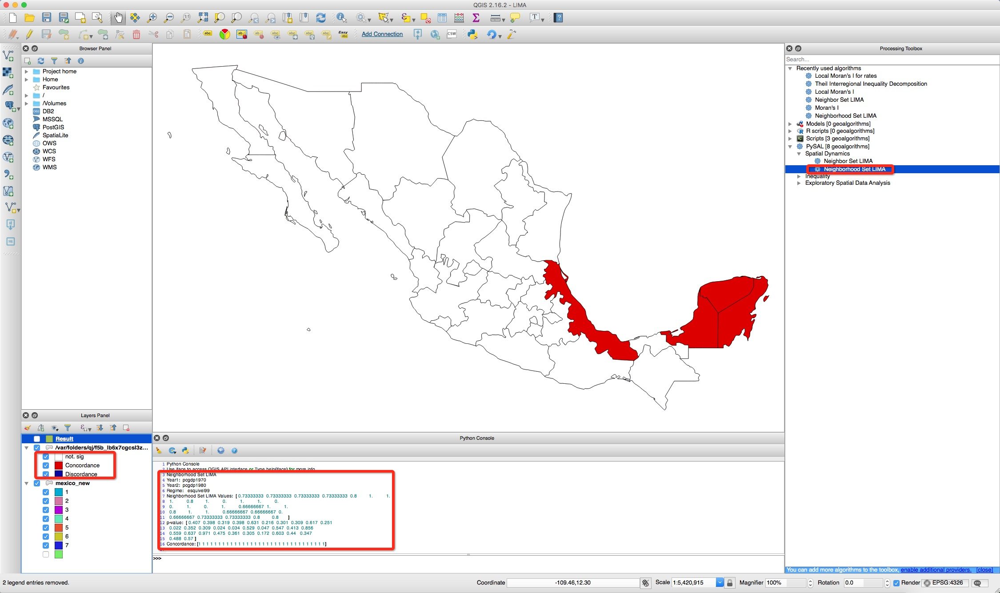
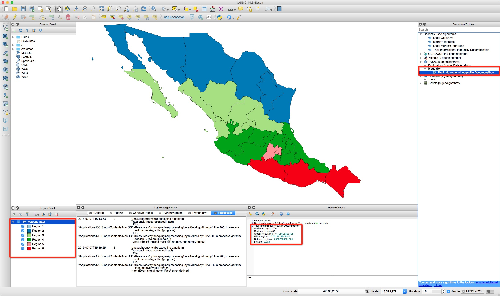
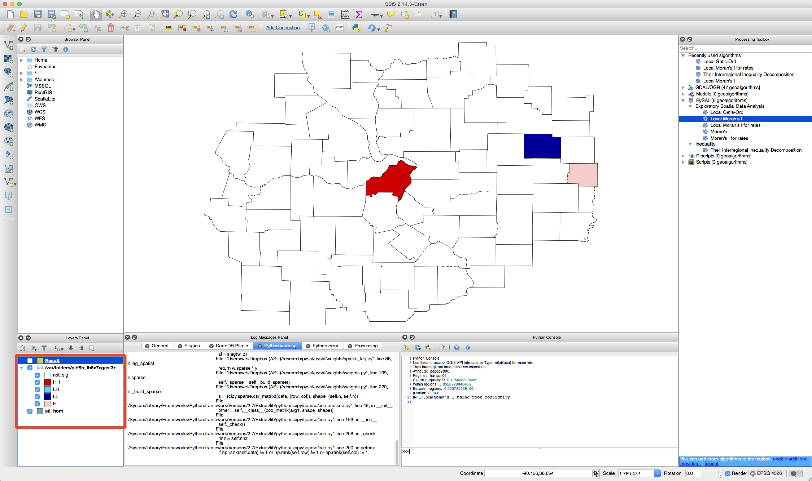

# Progress, Questions and Potential Directions for Pysal-plugin for QGIS
-----------

## Progress

### Implementation so far:
* Exploratory Spatial Data Analysis
    * [Moran's I](https://github.com/weikang9009/processing_pysal/blob/integrate/moran.py) 
    * [Moran's I for rates](https://github.com/weikang9009/processing_pysal/blob/integrate/moranrate.py)
    * [Local Moran's I](https://github.com/weikang9009/processing_pysal/blob/integrate/moranlocal.py)
    * [Local Moran's I for rates](https://github.com/weikang9009/processing_pysal/blob/integrate/moranlocal.py)
    * [Local Getis-Ord](https://github.com/weikang9009/processing_pysal/blob/integrate/moranlocal.py)
* Inequality 
    * [Theil Interregional Inequality Decomposition](https://github.com/weikang9009/processing_pysal/blob/integrate/dtheil.py)
* Spatial Dynamics




### Visualization

#### 1. Automatic rendering output layer for LISAs (significant spots):
* local Moran's I: not significant, HH, LH, LL, HL
* local Moran's I for rates: not significant, HH, LH, LL, HL 
* local Getis-Ord: not significant, LL, HH 

#### 2. Automatic rendering output layer for LIMAs (significant spots):
* Neighbor set LIMA: not significant, Concordance, Discordance 
* Neighborhood set LIMA: not significant, Concordance, Discordance 


#### 3. Automatic rendering the original layer after calculation
* Categorical style by the input regionalization scheme for Theil Interregional Inequality Decomposition 

## Questions

* How to get the output vector layer which would be rendered? The [code](https://github.com/weikang9009/processing_pysal/blob/integrate/moranlocal.py#L109)

```python
layer = dataobjects.getObjectFromUri(self.getOutputValue(self.OUTPUT))
```
will render another vector layer instead of "Result" layer:



* Input of multiple fields: is there a convenient way in QGIS?
    * for spatiotemporal analysis: input fields are the same attribute at sequential time points where order is of significance.
    * for comparison analysis: input fields are the same attribute for different distributions or at different time points.
    
* Color for map rendering
    * Use the python library [Palettable](https://jiffyclub.github.io/palettable/) which offers diverging, qualitative and sequential color palettes for Python.
    * Use qt colors.
    
    
## Potential Directions:

* Implementation of spatial weights builder
    * Continguity weights: integration of [weights builder](https://github.com/sjsrey/QGIS-Processing-tools/blob/master/2.6/scripts/weights_builder.py)
    * [Distance based spatial weights](https://github.com/pysal/pysal/blob/master/pysal/weights/Distance.py)
* Implementation of other [pysal ESDA measures](https://github.com/pysal/pysal/tree/master/pysal/esda).
* Implementation of [pysal spatial dynamics module](https://github.com/pysal/pysal/tree/master/pysal/spatial_dynamics) which comprises of spatiotemporal analysis methods:
    * Is there a spatial data structure with a time component existing for QGIS? 
    * Multiple fields input
    * Output array/matrix for future usage (such as the estimated transition probability matrix for [Markov](https://github.com/pysal/pysal/blob/master/pysal/spatial_dynamics/markov.py#L64) 
    or [Spatial Markov](https://github.com/pysal/pysal/blob/master/pysal/spatial_dynamics/markov.py#L214)
    * Space-time visualization